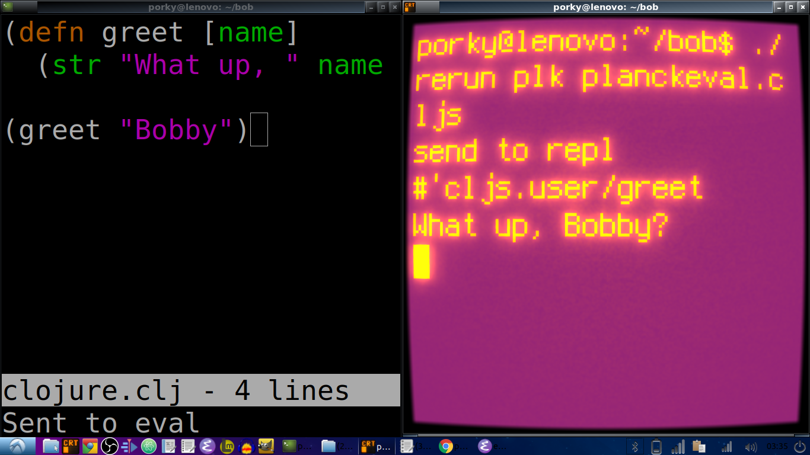

# Bob the Editor!


[Watch screencast](https://youtu.be/f_1ZLgQtaWg)

## "Can we build it?"
    
>"Derp de derrrrr!"
    
It takes like 2 seconds, all you need is a C compiler. To check if it's there type:

	$ cc --version

Install it (if needed) with:

    $ sudo apt-get install gcc make

# Build Bob

Download bob.c and (from its directory) enter:

    $ make bob

# Install Bob

Put the binary on your $PATH to install Bob:

	$ mv bob ~/bin/bob
	
# Use Bob
	
	$ bob [FILENAME]

# Clojure evaluation

The Ctrl+e key-binding sends the buffer to [Planck](http://planck-repl.org/) which prints the result of the last expression.
Open another terminal and run the `rerun` script (set to executable with `chmod +x rerun`) to connect to your REPL:

```
$ ./rerun plk planckeval.cljs
```
`rerun` uses `inotifywait` to watch and reload your code. You must have `inotifywait` installed on your machine, as well as Planck.

# What I wanted

A truly minimal console-based text editor that a beginning programmer can easily read, comprehend and modify.

## What I actually wanted

When people tell me to use a certain text editor - to be able to punch them in the face and say,
	
>"I use BOB, Biotch."

# What I got


Here it is inside of [Cool Retro Term](https://github.com/Swordfish90/cool-retro-term), cuz that's how I roll.

# TODO:

Figure out how to use a real Socket REPL (it's just Telnet) or pREPL.

# How it works
We're starting with the actual bash terminal and literally bashing on it, smashing it into pieces until it does what we want, which is to put rows of characters on the screen. Normal console behavior is to wait for you to type a whole line and press enter, and then the computer does a thing. We need to change the input mode so that the interface responds in real time every time a key is pressed. We call this "raw mode", and is defined by this function:

    void enableRawMode() {
        if (tcgetattr(STDIN_FILENO, &E.orig_termios) == -1) die("tcgetattr");
        atexit(disableRawMode);
        struct termios raw = E.orig_termios;
        raw.c_iflag &= ~(BRKINT | ICRNL | INPCK | ISTRIP | IXON);
        raw.c_oflag &= ~(OPOST);
        raw.c_cflag |= (CS8);
        raw.c_lflag &= ~(ECHO | ICANON | IEXTEN | ISIG);
        raw.c_cc[VMIN] = 0;
        raw.c_cc[VTIME] = 1;
        if (tcsetattr(STDIN_FILENO, TCSAFLUSH, &raw) == -1) die("tcsetattr");
    }

    void disableRawMode() {
        if (tcsetattr(STDIN_FILENO, TCSAFLUSH, &E.orig_termios) == -1)
        die("tcsetattr");
    }
    
We have also disabled Ctrl-C, Ctrl-Z, Ctrl-S, Ctrl-Q, and Ctrl-V so those system signals will not interfere with our program. But don't worry, we stored the original settings so that we can put them back when we're done.

## Define input keys...

    int editorReadKey() {
        int nread;
        char c;
        while ((nread = read(STDIN_FILENO, &c, 1)) != 1) {
            if (nread == -1 && errno != EAGAIN) die("read");
        }
        if (c == '\x1b') {
            char seq[3];
            if (read(STDIN_FILENO, &seq[0], 1) != 1) return '\x1b';
            if (read(STDIN_FILENO, &seq[1], 1) != 1) return '\x1b';
            if (seq[0] == '[') {
                if (seq[1] >= '0' && seq[1] <= '9') {
                    if (read(STDIN_FILENO, &seq[2], 1) != 1) return '\x1b';
                    if (seq[2] == '~') {
                        switch (seq[1]) {
                            case '1': return HOME_KEY;
                            case '3': return DEL_KEY;
                            case '4': return END_KEY;
                            case '5': return PAGE_UP;
                            case '6': return PAGE_DOWN;
                            case '7': return HOME_KEY;
                            case '8': return END_KEY;
                        }
                    }
                } else {
                    switch (seq[1]) {
                        case 'A': return ARROW_UP;
                        case 'B': return ARROW_DOWN;
                        case 'C': return ARROW_RIGHT;
                        case 'D': return ARROW_LEFT;
                        case 'H': return HOME_KEY;
                        case 'F': return END_KEY;
                    }
                }
            } else if (seq[0] == 'O') {
            switch (seq[1]) {
                case 'H': return HOME_KEY;
                case 'F': return END_KEY;
            }
        }
        return '\x1b';
        } else {
            return c;
        }
    }

## ...and how they are processed

	void editorMoveCursor(int key) {
  		erow *row = (E.cy >= E.numrows) ? NULL : &E.row[E.cy];
  		switch (key) {
    			case ARROW_LEFT:
      				if (E.cx != 0) {
        				E.cx--;
      				} else if (E.cy > 0) {
        				E.cy--;
        				E.cx = E.row[E.cy].size;
      				}
      				break;
    			case ARROW_RIGHT:
      				if (row && E.cx < row->size) {
        				E.cx++;
      				} else if (row && E.cx == row->size) {
        				E.cy++;
        				E.cx = 0;
      				}
      				break;
    			case ARROW_UP:
      				if (E.cy != 0) {
        				E.cy--;
      				}
      				break;
    			case ARROW_DOWN:
      				if (E.cy < E.numrows) {
        				E.cy++;
      				}
      				break;
  			}
  		row = (E.cy >= E.numrows) ? NULL : &E.row[E.cy];
  		int rowlen = row ? row->size : 0;
  		if (E.cx > rowlen) {
    			E.cx = rowlen;
  		}
	}

    void editorProcessKeypress() {
        static int quit_times = 1;
        int c = editorReadKey();
        switch (c) {
            case '\r':
                editorInsertNewline();
                break;
            case CTRL_KEY('q'):
                if (E.dirty && quit_times > 0) {
                    editorSetStatusMessage("Unsaved changes! Ctrl-Q to confirm.");
                    quit_times--;
                    return;
                }
	            printf("\r\n");
                exit(0);
                break;
            case CTRL_KEY('s'):
                editorSave();
                break;
            case HOME_KEY:
                E.cx = 0;
                break;
            case END_KEY:
                if (E.cy < E.numrows)
                E.cx = E.row[E.cy].size;
                break;
            case BACKSPACE:
            case CTRL_KEY('h'):
            case DEL_KEY:
                if (c == DEL_KEY) editorMoveCursor(ARROW_RIGHT);
                editorDelChar();
                break;
            case PAGE_UP:
            case PAGE_DOWN:
                {
                    if (c == PAGE_UP) {
                        E.cy = E.rowoff;
                    } else if (c == PAGE_DOWN) {
                        E.cy = E.rowoff + E.screenrows - 1;
                        if (E.cy > E.numrows) E.cy = E.numrows;
                    }
                    int times = E.screenrows;
                    while (times--)
                        editorMoveCursor(c == PAGE_UP ? ARROW_UP : ARROW_DOWN);
                }
                break;
            case ARROW_UP:
            case ARROW_DOWN:
            case ARROW_LEFT:
            case ARROW_RIGHT:
                editorMoveCursor(c);
                break;
            case CTRL_KEY('l'):
            case '\x1b':
                break;
            default:
                editorInsertChar(c);
                break;
        }
        quit_times = 1;
    }

## Rendering characters to the screen

	void editorDrawRows(struct abuf *ab) {
  		int y;
  		for (y = 0; y < E.screenrows; y++) {
    			int filerow = y + E.rowoff;
    			if (filerow >= E.numrows) {
      				if (E.numrows == 0 && y == E.screenrows / 3) {
        				char welcome[80];
        				int welcomelen = snprintf(welcome, sizeof(welcome),
						"Bob's Text Editor -- You've tried the rest");
        				if (welcomelen > E.screencols) welcomelen = E.screencols;
        				int padding = (E.screencols - welcomelen) / 2;
        				if (padding) {
          					abAppend(ab, " ", 1);
          					padding--;
        				}
        				while (padding--) abAppend(ab, " ", 1);
        				abAppend(ab, welcome, welcomelen);
      				} else {
        			abAppend(ab, " ", 1);
      				}
    			} else {
      				int len = E.row[filerow].rsize - E.coloff;
      				if (len < 0) len = 0;
      				if (len > E.screencols) len = E.screencols;
      				abAppend(ab, &E.row[filerow].render[E.coloff], len);
    			}
    			abAppend(ab, "\x1b[K", 3);
    			abAppend(ab, "\r\n", 2);
  		}
	}

	void editorRefreshScreen() {
  		editorScroll();
  		struct abuf ab = ABUF_INIT;
  		abAppend(&ab, "\x1b[?25l", 6);
  		abAppend(&ab, "\x1b[H", 3);
  		editorDrawRows(&ab);
  		editorDrawStatusBar(&ab);
  		editorDrawMessageBar(&ab);
		char buf[32];
  		snprintf(buf, sizeof(buf), "\x1b[%d;%dH", (E.cy - E.rowoff) + 1,
                                            (E.rx - E.coloff) + 1);
  		abAppend(&ab, buf, strlen(buf));
  		abAppend(&ab, "\x1b[?25h", 6);
  		write(STDOUT_FILENO, ab.b, ab.len);
  		abFree(&ab);
	}

## Open files

	void editorOpen(char *filename) {
  		free(E.filename);
  		E.filename = strdup(filename);
  		FILE *fp = fopen(filename, "r");
  		if (!fp) die("fopen");
  		char *line = NULL;
  		size_t linecap = 0;
  		ssize_t linelen;
  		while ((linelen = getline(&line, &linecap, fp)) != -1) {
    			while (linelen > 0 && (line[linelen - 1] == '\n' ||
                           line[linelen - 1] == '\r'))
      				linelen--;
    			editorInsertRow(E.numrows, line, linelen);
  		}
  		free(line);
  		fclose(fp);
  		E.dirty = 0;
	}

## Save files

	void editorSave() {
  		if (E.filename == NULL) {
    			E.filename = editorPrompt("Enter file name: %s (ESC to cancel)");
    			if (E.filename == NULL) {
      				editorSetStatusMessage("Save cancelled");
      				return;
    			}
  		}
  		int len;
  		char *buf = editorRowsToString(&len);
  		int fd = open(E.filename, O_RDWR | O_CREAT, 0644);
  		if (fd != -1) {
    			if (ftruncate(fd, len) != -1) {
      				if (write(fd, buf, len) == len) {
        				close(fd);
        				free(buf);
        				E.dirty = 0;
        				editorSetStatusMessage("%d bytes written", len);
        				return;
      				}
    			}
    			close(fd);
  		}
  		free(buf);
  		editorSetStatusMessage("Can't save! I/O error: %s", strerror(errno));
	}

# Credits 
[Salvatore Sanfilippo](https://github.com/antirez/kilo)

[Snaptoken]( https://viewsourcecode.org/snaptoken/kilo/)
